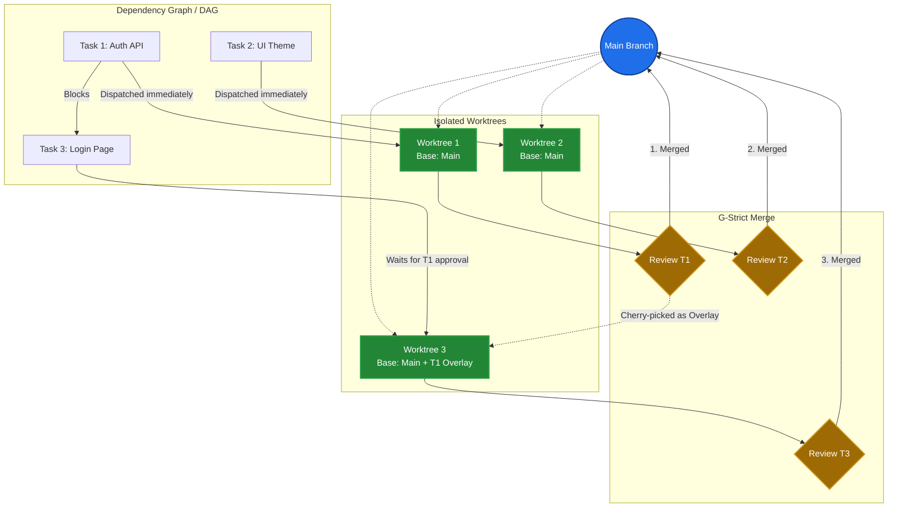
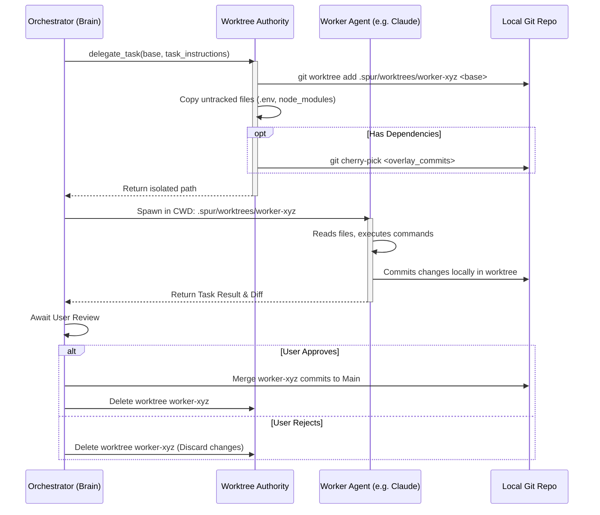

# Issues & Planning

Spur TUI provides powerful built-in tools for visualizing and managing your project's issues, dependencies, and execution plans. Rather than context-switching between your terminal and a web browser, you can inspect requirements, trace blockers, and track agent progress directly from the TUI.

## Issue Browser

The Issue Browser is your central hub for exploring tasks and epics. It synchronizes with your connected project management tracker (like GitHub, Linear, Plane, or local Beads) and displays issues alongside their metadata.

### Navigation and Detail Views

*   **`j` / `k`** or **Up / Down**: Navigate through the list of tracked issues.
*   **`g` / `G`**: Jump to the top or bottom of the list.
*   **`Enter`**: Open the detail pane for the currently selected issue.
*   **`Esc`**: Close the detail pane (or exit the Issue Browser if no detail pane is open).
*   **`PgUp` / `PgDn`**: Scroll through long issue descriptions or large graphs.

The detail pane has two modes: **Text Mode** (which shows the description, labels, and metadata) and **Graph Mode** (which maps out dependencies).

*   **`v`**: Toggle between Text Mode and Graph Mode for the selected issue.

### Managing Work

You can trigger agent actions or update issue states directly from the browser:

*   **`W` (Work on)**: Starts a new worker session to resolve the selected issue. 
*   **`E` (Execute Epic)**: Dispatches a planner agent to execute an entire epic. This option will show a confirmation modal before kicking off the workload.
*   **`r`**: Refresh the issue list from the upstream source.

**Quick Status Updates:**
*   **`o`**: Mark as Open
*   **`w`**: Mark as In Progress
*   **`b`**: Mark as Blocked
*   **`x` / `d`**: Mark as Closed

## Issue Dependency Graphs

When you press **`v`** while viewing an issue, the TUI switches to **Graph Mode**. The graph pane visualizes the dependency tree (what the current issue blocks, or is blocked by) using a visual depth-first search (DFS) tree.

The tree helps you identify execution order and potential circular dependencies:

*   **Legend**: 
    *   `○` Open
    *   `●` In Progress
    *   `!` Blocked
    *   `✓` Closed
*   **Cycles**: If an issue forms a circular dependency loop, it will be marked with a `↻ cycle` indicator.

If a graph has more nodes than can fit on your screen, use `PgUp` and `PgDn` to scroll, guided by the "↓ X more dependencies" hint at the bottom.

## Plan Inspector

When you ask the agent to execute a complex task or an epic, it generates a multi-stage **Plan**. The **Plan Inspector** provides a visual kanban-style board mapping the lifecycle of these tasks.

### The Board View

By default, on wider terminals, the Plan Inspector displays a side-by-side view:
*   **Stages (Lanes)**: The plan is broken down into sequential stages. All tasks in Stage 0 must complete before Stage 1 begins, and so on.
*   **Header**: Shows the plan's overall status (`RUNNING`, `APPROVED`, `FAILED`, etc.), a progress gauge (e.g., `4 / 10 done`), and the current action the brain is taking.
*   **Task Detail**: The right pane shows the execution logs, summaries, and agent output for the specifically highlighted task.

*(On narrower terminals, the lanes collapse into a stacked list to preserve readability.)*

### Navigating the Plan Inspector

*   **`h` / `l`** or **Left / Right**: Move horizontally between plan stages (lanes).
*   **`j` / `k`** or **Down / Up**: Select individual tasks within the current stage.
*   **`g` / `G`**: Jump to the first or last task in the current stage.
*   **`Esc`** or **`Alt-p`**: Close the Plan Inspector and return to the previous view.

### Task States & Meta Chips

Each task in the board shows a badge indicating its execution state:
*   `[QUE]`: Pending / Queued
*   `[RDY]`: Ready to run
*   `[RUN]`: Dispatched to a worker
*   `[REV]`: Awaiting review
*   `[PAS]`: Approved / Completed
*   `[ERR]`: Failed
*   `[REJ]`: Rejected (needs rework)
*   `[SKP]`: Cancelled / Skipped
*   `[SUP]`: Superseded
*   `BLOCKED`: Blocked by a setup conflict or another task.

Next to the task title, you may see **Meta Chips** providing live context:
*   **Live Worker** (e.g., `codex:run`): Displays the specific agent model and phase currently handling the task.
*   **Dependencies** (e.g., `↑T1`): Indicates which task IDs this task relies on.
*   **Retries** (e.g., `retry 2/3`): Shows if a task failed previously and is being re-attempted.
*   **Conflicts**: Explicit warnings if setup overlays conflicted (e.g., `2 files conflict with T1`).

## Worktree Isolation Discipline (The Spur Advantage)

A major challenge with AI coding agents is that they mutate files in your repository as they work. If you run two agents simultaneously, or try to continue your own coding while an agent is thinking, you will face file collisions, broken builds, and git conflicts.

**Spur solves this completely using automated Git Worktrees.**

Whenever the Brain orchestrator dispatches a task to a Worker agent, it does **not** run the worker in your main directory. Instead, Spur:

1. **Creates an Isolated Clone:** Automatically runs `git worktree add` to generate a temporary, hidden directory specific to that task.
2. **Synchronizes Environment:** Safely inherits untracked files (like `.env` or `node_modules`) so the worker's build environment is fully functional.
3. **Applies Overlays:** If the plan has dependencies (e.g., Task B relies on Task A), Spur cherry-picks Task A's commits into Task B's worktree *before* starting Task B.
4. **Executes in Isolation:** The worker agent (e.g., Claude Code, Codex) is "chrooted" into this directory. It is completely unaware of your main workspace.
5. **Extracts and Cleans Up:** Once the worker completes and you approve the review, Spur extracts the diff, merges the commits cleanly onto your main branch, and automatically deletes the temporary worktree.

### Why this is a Superpower
* **Massive Concurrency:** Spur can run 5 worker agents in parallel on 5 different tasks because they operate in 5 distinct directories.
* **Safe Exploration:** If a worker hallucinates and destroys the codebase, your main IDE checkout remains completely untouched. You simply reject the task in the Plan Inspector, and the tainted worktree is instantly deleted.
* **Uninterrupted Flow:** You can continue coding, running your local dev server, and pushing commits in your main directory while Spur agents work quietly in the background.

### Graph-Strict (G-Strict) Execution & Merge Strategy

Spur achieves effective parallel execution through a **Graph-Strict (G-Strict)** dependency and merge strategy. When the Brain creates a plan, it forms a Directed Acyclic Graph (DAG) of tasks. Spur uses this DAG to perfectly orchestrate isolated worktrees and eliminate merge conflicts:

**How the G-Strict Flow Works:**
1. **Parallel Dispatch:** `Task 1` and `Task 2` have no dependencies, so Spur spawns `Worktree 1` and `Worktree 2` simultaneously. They both branch off the current `Main` commit.
2. **Overlay Application:** `Task 3` depends on `Task 1`. Spur will not dispatch `Task 3` until `Task 1` is approved. Once approved, `Worktree 3` is created, and Spur automatically applies `Task 1`'s commits as an "overlay" so the worker can build upon the new Auth API.
3. **Deterministic Merging:** By strictly honoring the graph's topological order during the merge phase, Spur guarantees that dependent tasks are always merged *after* their prerequisites. This prevents the classic "integration hell" that usually occurs when multiple developers (or AI agents) work in parallel.

### The Worker Worktree Lifecycle

To understand what exactly happens when a worker operates on a task, here is the lifecycle of a single worker session:

This sequence ensures that the worker is physically "chrooted" into its isolated environment (`CWD: .spur/worktrees/worker-xyz`). It can safely run `npm install`, compile code, or even delete files without any risk to your primary developer checkout.

## Mermaid Diagram Visualization

> 🎥 **Video Placeholder:** [Show an agent generating a Mermaid block, the placeholder transforming to the ready state, and pressing Alt-v to render the visual graph inline.]

Spur TUI natively supports **Mermaid diagrams** within issue descriptions, chat messages, and plan details. Rather than dumping raw text, Spur renders them into actual visual graphs directly inside your terminal window using a built-in rasterizer (`resvg` / `tiny-skia`).

When the TUI encounters a Mermaid code block, you'll see a placeholder while it generates:
*   `[⏳ mermaid #1 rendering…]` (In progress)
*   `[⚠ mermaid #1 error]` (Failed to parse)
*   `[📊 mermaid #1 · press Alt-v to view]` (Ready)

Once ready, press **`Alt-v`** to toggle the inline visual display of the diagram. The TUI intelligently maps the scale of the image to the layout of your terminal pane so text remains crisp and readable.
